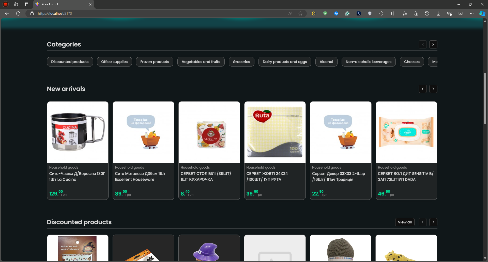

# PriceInsight

**PriceInsight** is a web application that allows users to track product prices across different supermarkets. Built using an ASP.NET API and React SPA, the platform currently crawls prices from two Ukrainian supermarkets: **ATB** and **Rukavychka**. The application is designed to be easily extensible, allowing new supermarket crawlers to be added with minimal effort. Users can sign up on the site to track specific products, allowing them to keep up to date with the latest prices of their favorite products.

## Features

- **Products Crawling**: Automatically crawls products from ATB and Rukavychka supermarkets.
- **Extensible Crawler System**: Easily add new supermarket crawler services inheriting from the **BaseMarketCrawler** class and overriding only the necessary logic (e.g., XPath queries).
- **User Accounts**: Users can sign up and follow products to track price changes over time.
- **React SPA**: Front-end built with React, providing a dynamic and responsive user experience.
- **ASP.NET API**: Back-end API built with ASP.NET, providing the data to the front-end and handling crawling logic.

## Screenshots
<div style="display: flex; gap: 10px; flex-wrap: wrap;">
  
  
  
  
  
</div>

## Extending the Crawler

To add a new supermarket:

1. Create a new class that inherits from the base `BaseMarketCrawler<T>` class.
2. Override the necessary logic such as XPath queries to target specific product data.
3. Register the new supermarket in the system for it to be crawled.

### Example:

#### NewSupermarketCrawler.cs
```csharp
public class NewSupermarketCrawler : BaseMarketCrawler<NewSupermarketCrawler>
{
    protected override string CategoryNodesXPath =>
        "//ul[@class='category-list']/li[contains(@class, 'category-list-item')]/a";

    protected override string CategoryNameXPath => ".//span[@class='category-link']";
    // And so on...

    public NewSupermarketCrawler(
        IHttpClientFactory httpClientFactory,
        IServiceProvider serviceProvider,
        ILogger<NewSupermarketCrawler> logger,
        MarketCrawlersConfiguration crawlersConfiguration,
        IProductMatcher productMatcher
    )
        : base(
            httpClientFactory.CreateClient(HttpClients.Simple),
            serviceProvider,
            logger,
            crawlersConfiguration,
            "NewSupermarket",
            productMatcher)
    {
    }

    protected override (decimal? Price, decimal? DiscountedPrice) GetProductCardPrices(HtmlNode productCardNode)
    {
        var (price, discountedPrice) = base.GetProductCardPrices(productCardNode);
        if (price is not null && discountedPrice is not null)
        {
            // Swap it around to make it relevant to the way it is displayed on the site when the product has a discount
            return (discountedPrice, price);
        }

        return (price, null);
    }
}
```

#### Program.cs
```csharp
builder.Services.AddSingleton<IMarketCrawler, NewSupermarketCrawler>();
```

#### appsettings.json
```json
"MarketCrawlers": {
  "NewSupermarket": {
    "Name": "NewSupermarket",
    "BaseUrl": "https://newsupermarket.com/"
  }
}
```

## License

This project is licensed under the [Non-Commercial License v1.0](./LICENSE).

## Contact

For any inquiries, contact me at: offseires@gmail.com.
